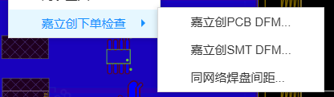
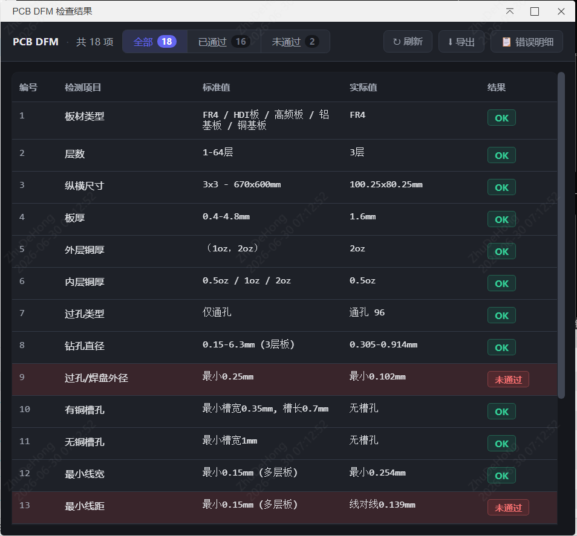
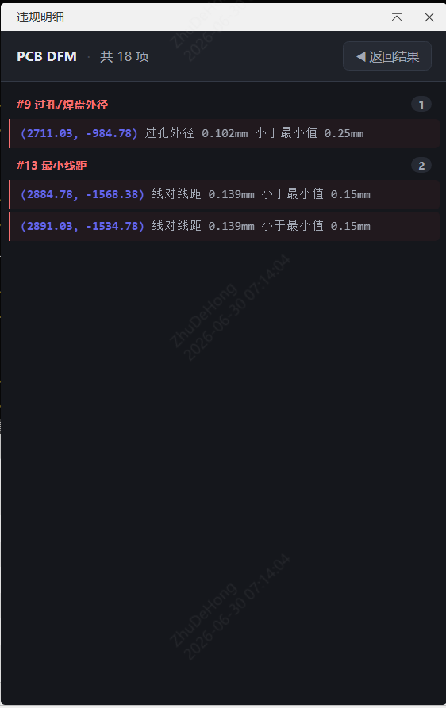
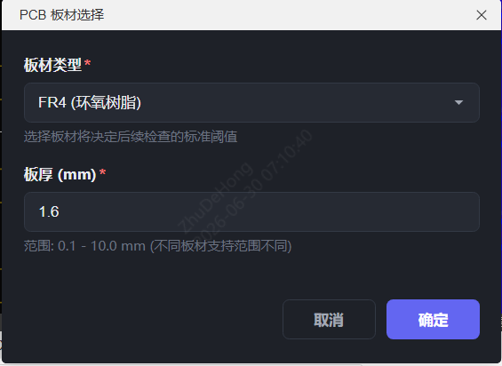
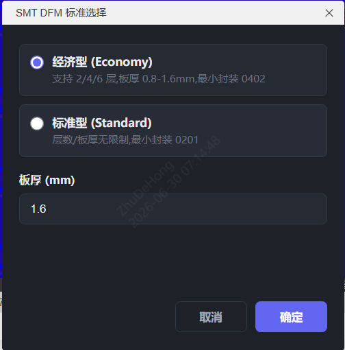
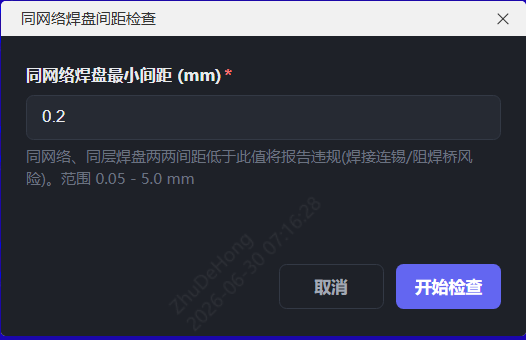

# 嘉立创 DFM 检查工具

> 一款嘉立创 EDA 专业版扩展，一键检测 PCB 设计是否符合嘉立创制造工艺要求；违规项可点击定位、可导出报告。

  

## 效果速览

**头部菜单** —— PCB 编辑器顶部「嘉立创下单检查」展开后共三项入口：

**PCB DFM 结果主窗** —— 18 项检查结果表格，顶部支持「全部 / 已通过 / 未通过」过滤、刷新、导出，以及「错误明细」切换：

**错误明细窄窗** —— 点击「错误明细」后切换到的窄窗，只显示违规明细、减少对画布的遮挡，违规项可点击定位；右上角支持折叠，点「◀ 返回结果」或关闭即回到主窗：

## 简介

「嘉立创 DFM 检查工具」面向使用嘉立创 EDA 专业版进行 PCB 设计的工程师。它在设计阶段即对照**嘉立创官方工艺标准**逐项检查当前 PCB，提前发现可能导致制造困难或返工的问题（线宽 / 线距、孔径、焊环、槽孔、BGA、丝印字符等），并对每一条违规给出**坐标 + 原因**，可在画布上点击定位、高亮对应元素，便于快速修正。

- **覆盖范围**：PCB DFM 共 **18** 项 + SMT DFM 共 **7** 项 + 同网络焊盘间距检查。
- **标准权威**：阈值取自嘉立创官方工艺参数，按板材、层数、铜厚自动匹配，**无需手工填写工艺参数**。
- **遮挡更少**：结果主窗只显示总览表格，违规明细通过「错误明细」按钮切换到独立窄窗查看，不挤压画布。
- **定位精准**：违规项记录图元 ID 与坐标，点击明细即可选中并缩放到对应元素。
- **结果可导出**：可一键导出 `.txt` 报告。

## 功能特性

### PCB DFM（18 项）

| 类别 | 检查项 |
|------|--------|
| 基础信息 | 板材类型、层数、纵横尺寸、板厚、外层铜厚、内层铜厚、过孔类型（通孔 / 盲孔 / 埋孔单独识别） |
| 过孔与槽孔 | 钻孔直径（过孔 + 焊盘）、过孔 / 焊盘外径、有铜槽孔、无铜槽孔 |
| 线路与间距 | 最小线宽、最小线距、焊盘 / 过孔到线间距、有铜插件焊盘焊环、无铜插件焊盘焊环 |
| 特殊元件与丝印 | BGA 焊盘、丝印字符 |

> - 盲孔与埋孔可单独区分（绕开编辑器枚举把二者合并的限制）。
> - 焊盘到线按矩形焊盘的真实旋转精确求距，并自动跳过同网络（含覆铜十字连接）的元素，避免误报。

### SMT DFM（7 项）

执行前选择「经济型」或「标准型」标准，依次检查：焊接面、层数、板厚、纵横尺寸、最小封装（经济型最小 0402 / 标准型最小 0201）、最小 IC 引脚间距、BGA 球径间距。

### 同网络焊盘间距

独立菜单，手动设定最小间距值（mm），检查同网络焊盘两两之间的间距是否满足要求。

## 支持板材

标准取自嘉立创官方工艺参数；其中部分参数会随层数 / 铜厚自动分段匹配：

| 板材 | 层数 | 可选板厚 |
|------|------|----------|
| FR4 | 1–64 | 0.4–4.8 mm（支持盲埋孔，可区分盲 / 埋） |
| HDI 板 | 4–32 | 0.5–2.4 mm（盲孔 0.075–0.15 / 埋孔 0.15–0.55） |
| 高频板 | 2 | 0.51 / 0.76 / 1.52 mm |
| 铝基板 | 1 | 0.8 / 1.0 / 1.2 / 1.6 mm |
| 铜基板 | 2 | 1.0 / 1.2 / 1.6 mm |

> 例如 FR4 的最大尺寸按层数分 4 档、最小线宽 / 线距按外层铜厚分 7 档（1oz 0.10 mm → 6oz 0.45 mm），工具会根据实际板子自动选取对应阈值。

## 使用方法

工具挂在 **PCB 编辑器**的头部菜单「嘉立创下单检查」下，共三项菜单。

> 菜单截图：

### 1. PCB DFM

1. 在 PCB 编辑器中打开待检板子，点击菜单 **嘉立创下单检查 → 嘉立创 PCB DFM…**。
2. 在弹出的「板材类型 / 板厚」对话框中选择板材、填写板厚并确定。

   > 

3. 工具自动采集图元、解析设计文件（铜厚、盲埋孔规则）并执行 18 项检查。
4. 检查完成后，底部日志面板输出摘要，同时弹出**结果主窗**：以表格列出每项的「编号 / 检测项目 / 标准值 / 实际值 / 结果」（结果分未通过 / 警告 / OK）。

   > 

5. 结果主窗顶部工具栏：
   - 「全部 / 已通过 / 未通过」分段过滤；
   - 「刷新」按最新数据原地重跑（不重开窗口）；
   - 「导出」一键导出 `.txt` 报告；
   - 「错误明细」切换到独立窄明细窗。
6. 点击「错误明细」→ 隐藏主窗、弹出**窄明细窗**（只显示违规明细，按检测项目分组），减少对画布的遮挡；明细窗右上角可折叠，点「◀ 返回结果」或关闭即回到主窗。

   > 

7. 点击明细中的违规项 → 画布选中并缩放到对应元素，便于快速修正。

### 2. SMT DFM

1. 点击菜单 **嘉立创下单检查 → 嘉立创 SMT DFM…**。
2. 在弹出的对话框中选择「经济型」或「标准型」并确定。

   > 

3. 执行 7 项检查，结果同样在结果主窗中展示，交互与 PCB DFM 一致（过滤 / 错误明细 / 导出 / 点击定位）。

### 3. 同网络焊盘间距

1. 点击菜单 **嘉立创下单检查 → 同网络焊盘间距…**。
2. 在弹出的对话框中输入最小间距（mm）并确定。

   > 

3. 执行检查并在结果窗展示违规明细。

## 环境要求

- 嘉立创 EDA 专业版 **V3** 及以上（`engines.eda: ^3.0.0`）。
- 需在 **PCB 编辑器**内使用（原理图编辑器不适用）。

## 安装

1. 获取扩展包 `.eext`（开发时运行 `npm run build` 生成，文件名以 `jlc-order-dfm-checker` 开头）。
2. 在嘉立创 EDA 专业版中：**顶部菜单 → 高级 → 扩展管理器 → 导入**，选择该 `.eext` 文件完成安装。
3. 进入 PCB 编辑器，即可在头部菜单看到「嘉立创下单检查」。

## 说明

- **标准固定**：本工具仅按嘉立创官方工艺检测，不提供自定义工艺参数。
- **板材 / 板厚**：因编辑器 API 不提供板材与板厚接口，这两项需在弹窗中由用户选择 / 填写；外层 / 内层铜厚与过孔类型则自动从设计文件解析，无需手工输入。
- **结果窗交互**：主窗只看总览表格，违规明细走「错误明细」窄窗（可折叠、可返回），刻意把明细与总览分窗以减少对画布的遮挡。
- **更新扩展**：开发或更新扩展后，需在扩展管理器中**重新导入** `.eext`（或重启 EDA）才能让新代码生效；扩展自身无法在运行时热刷新。
- **不会改动设计**：工具只读取并分析设计数据，不会修改你的 PCB / 原理图。

## 反馈与参考

- 嘉立创工艺参数：<https://www.jlc.com/portal/vtechnology.html>
- 嘉立创 EDA 专业版：<https://pro.lceda.cn/>
- 嘉立创 EDA 扩展开发文档：<https://prodocs.lceda.cn/cn/api/guide/>

## 开源许可

[Apache License 2.0](./LICENSE)
